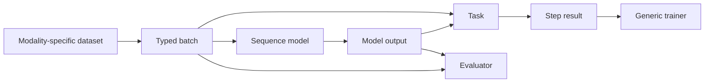
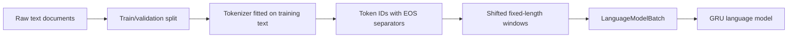
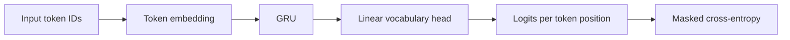

# Goldfish Architecture

Goldfish is a PyTorch framework for sequential modelling. Its first vertical slice is **causal text prediction** (next-token language modelling), while its core contracts remain modality-agnostic so that numeric forecasting and text-plus-numeric models can be added without redesigning training infrastructure.

## Goals

- Provide small, understandable reference implementations of sequential models.
- Train text, numeric, and multimodal sequence models through the same core training lifecycle.
- Keep modality-specific data representation, losses, metrics, and inference at the edges.
- Make experiments reproducible through resolved configuration, checkpoints, and recorded prediction artifacts.
- Support causal/forecasting semantics: a prediction at a cutoff may use only information available at or before that cutoff.

## Non-goals for the first vertical slice

- Training a production-scale language model.
- Building a tokenizer from scratch beyond a simple educational character tokenizer.
- Supporting every architecture, optimizer, or task immediately.
- Combining text and numeric data in the first implementation.
- Providing trading or backtesting functionality before the forecasting data and evaluation contracts are established.

## Design principle

> Share framework contracts and reusable sequence components; do not force distinct modalities into one universal tensor format.

Text tokens are discrete IDs and produce vocabulary logits. Numeric sequences are continuous feature vectors and usually produce horizon-based forecasts. These have different data and task semantics, but use the same lifecycle:

```text
batch -> model -> model output -> task -> loss/metrics -> trainer
```



## Package boundaries

The intended structure is:

```text
goldfish/
├── goldfish/
│   ├── core/
│   │   ├── batch.py           # Minimal Batch protocol
│   │   ├── output.py          # ModelOutput
│   │   └── task.py            # Task and StepResult protocols
│   ├── data/
│   │   ├── text/              # Tokenizers, corpora, LM batches
│   │   └── numeric/           # Future windows, feature schemas, forecast batches
│   ├── models/
│   │   ├── components/        # Reusable GRU/LSTM/Transformer blocks and heads
│   │   ├── language/          # Language-model compositions
│   │   └── numeric/           # Future forecast-model compositions
│   ├── tasks/
│   │   ├── causal_lm.py
│   │   └── forecasting.py
│   ├── training/              # Trainer, callbacks, checkpointing
│   ├── evaluation/            # Modality/task-specific evaluators
│   ├── generation/            # Text decoding and generation utilities
│   └── config/                # Config loading and validation
├── configs/
│   ├── text/
│   └── numeric/
├── runs/                      # Git-ignored experiment artifacts
└── ARCHITECTURE.md
```

Directories should be created when their first implementation is needed. The structure describes ownership boundaries, not boilerplate requirements.

## Core contracts

### Batch

The trainer needs only a minimal batch contract:

```python
class Batch(Protocol):
    def to(self, device: torch.device) -> Self:
        """Return this batch with every tensor moved to `device`."""
```

Goldfish uses separate typed batches for different modalities. A batch must not contain irrelevant optional fields merely to satisfy a universal schema.

#### Text: causal language modelling

```python
@dataclass
class LanguageModelBatch:
    input_ids: Tensor          # [batch, time]
    target_ids: Tensor         # [batch, time]
    attention_mask: BoolTensor # [batch, time]; True for valid positions

    def to(self, device: torch.device) -> Self: ...
```

`target_ids` is `input_ids` shifted one token forward. For the token sequence:

```text
[the, market, opened, higher, today]
```

one training window is:

```text
input:  [the, market, opened, higher]
target: [market, opened, higher, today]
```

#### Numeric: future forecasting

```python
@dataclass
class NumericForecastBatch:
    numeric_values: Tensor     # [batch, time, features]
    target_values: Tensor      # [batch, horizons]
    padding_mask: BoolTensor   # [batch, time]; True for valid steps
    cutoff_timestamps: Tensor  # Metadata required for ordered evaluation

    def to(self, device: torch.device) -> Self: ...
```

This is a future extension, not part of the first vertical slice.

#### Multimodal: text plus numeric

A future multimodal batch will remain structured rather than flattening every source into a single tensor:

```python
@dataclass
class MultimodalForecastBatch:
    numeric_values: Tensor
    numeric_padding_mask: BoolTensor
    text_input_ids: Tensor | None
    text_attention_mask: BoolTensor | None
    text_timestamps: Tensor | None
    target_values: Tensor
    cutoff_timestamps: Tensor

    def to(self, device: torch.device) -> Self: ...
```

A later event-Transformer may use a separate event-token batch with event type IDs and timestamps. It should not force late-fusion models to use that format.

### Model output

Every neural model returns a structured output:

```python
@dataclass
class ModelOutput:
    predictions: dict[str, Tensor]
    representations: Tensor | None = None
    aux_losses: dict[str, Tensor] = field(default_factory=dict)
    diagnostics: dict[str, Tensor | float] = field(default_factory=dict)
```

Examples:

```python
# Causal language model
ModelOutput(predictions={"token_logits": logits})
# logits: [batch, time, vocabulary_size]

# Numeric point forecast
ModelOutput(predictions={"forecast": values})
# values: [batch, horizons]

# Mixture-of-experts model
ModelOutput(
    predictions={"forecast": values},
    aux_losses={"load_balance": balance_loss},
    diagnostics={"router_entropy": entropy},
)
```

The model may report an auxiliary loss, but the task/configuration determines how it contributes to total optimization loss.

### Task

A task defines target interpretation, the primary loss, and step-level metrics:

```python
@dataclass
class StepResult:
    loss: Tensor
    metrics: dict[str, Tensor | float]


class Task(Protocol):
    def compute(self, output: ModelOutput, batch: Batch) -> StepResult:
        ...
```

Initial and planned tasks:

| Task | Prediction | Loss | Primary metrics |
|---|---|---|---|
| Causal language modelling | token logits | masked cross entropy | loss, perplexity |
| Point forecasting | future values/returns | Huber, MSE, or MAE | MAE, RMSE, direction accuracy |
| Direction classification | class logits | cross entropy/BCE | accuracy, F1, calibration |
| Quantile forecasting | quantile values | pinball loss | coverage, pinball loss |
| Contrastive representation learning | embeddings | contrastive loss | retrieval/probe metrics |

### Trainer

The generic trainer must not branch on model names or modality types. Its training step is conceptually:

```python
batch = batch.to(device)
output = model(batch)
result = task.compute(output, batch)
total_loss = result.loss + weighted_sum(output.aux_losses)
total_loss.backward()
optimizer.step()
```

It owns:

- device selection;
- optimizer and scheduler execution;
- automatic mixed precision;
- gradient accumulation and gradient clipping;
- train/validation loops;
- metric aggregation and logging;
- early stopping;
- checkpoint save/resume;
- deterministic mode and seed handling.

It does **not** own tokenization, feature engineering, decoding, chronological fold construction, or task-specific evaluation logic.

## First vertical slice: causal text prediction

### Data pipeline



The first dataset implementation should:

1. accept a legally usable local plain-text corpus;
2. split documents into train and validation sets before fitting tokenizer state;
3. insert an end-of-document (`EOS`) token between documents;
4. encode documents into token IDs;
5. form contiguous fixed-length windows;
6. create inputs and next-token targets shifted by one position;
7. shuffle completed training windows if desired, but never reorder tokens within a window.

### Tokenizer interface

A tokenizer is text-specific infrastructure. The framework begins with a character-level implementation for clarity, while allowing adapters to external subword tokenizers later.

```python
class Tokenizer(Protocol):
    pad_token_id: int | None
    eos_token_id: int
    vocab_size: int

    def fit(self, texts: Iterable[str]) -> None: ...
    def encode(self, text: str) -> list[int]: ...
    def decode(self, token_ids: Sequence[int]) -> str: ...
    def save(self, path: Path) -> None: ...
```

Tokenizer artifacts must be saved with the experiment/data artifacts so that token IDs remain interpretable when resuming or evaluating a run.

### First model: GRU language model

```text
token IDs -> token embedding -> GRU backbone -> vocabulary head -> token logits
```



Expected model I/O:

```text
input_ids: [B, T]
token embeddings: [B, T, embedding_dim]
GRU hidden states: [B, T, hidden_dim]
token_logits: [B, T, vocab_size]
```

The model predicts the next token at every position. The `CausalLanguageModelTask` applies cross-entropy to all valid target positions and ignores padding if present.

An LSTM language model is the next comparison model. A causal Transformer is added only after the GRU training, evaluation, checkpointing, and generation paths work end to end.

### Text generation

Generation is text-specific inference, separate from the generic trainer:

```text
prompt -> model -> next-token distribution -> select token -> append -> repeat
```

The initial generator should support greedy decoding and temperature/top-k sampling. A GRU/LSTM generator should reuse recurrent hidden state after processing the prompt instead of repeatedly evaluating the entire generated prefix.

## Numeric forecasting extension

Numeric forecasting will reuse the core trainer, output, task, checkpoint, configuration, and experiment contracts.

### Intended model composition

```text
numeric values -> feature projection -> temporal backbone -> forecast head
```

- A feature projection replaces a text token embedding.
- A temporal backbone may be an MLP window, GRU, LSTM, TCN, causal Transformer, or state-space model.
- A forecast head replaces the vocabulary head.
- A forecasting task replaces causal language-modelling loss/metrics.

For example:

```text
[B, time, numeric_features]
    -> Linear(numeric_features, hidden_dim)
    -> GRU
    -> last valid hidden state
    -> Linear(hidden_dim, horizons)
    -> future return/value forecast
```

### Causality and leakage invariants

For a prediction with cutoff `t`:

- inputs may contain only information available at or before `t`;
- targets describe an interval after `t`;
- train/validation/test splits are chronological, not random;
- normalizers are fit only on training data;
- evaluation retains cutoff timestamps and entity IDs;
- features must declare whether they are static, observed, known future, or targets.

These conditions belong primarily to data/split construction, not to the generic trainer.

## Reusable model components

Goldfish shares building blocks, not entire modality-specific model classes.

| Component | Text usage | Numeric usage |
|---|---|---|
| Embedding/projection | token IDs -> vectors | feature vectors -> hidden vectors |
| GRU/LSTM backbone | contextual token states | contextual timestep states |
| Causal Transformer | next-token context | causal event/window context |
| Pooler | rarely needed for per-token LM | final valid state / forecast token |
| Output head | hidden state -> vocabulary logits | hidden state -> forecasts |

The first reusable component should be a `GRUBackbone`. It receives already embedded continuous inputs of shape `[B, T, D]` and returns contextual states. Language and numeric models own their input projection and output head.

## Configuration and experiment artifacts

Configurations merge defaults, YAML, and explicit CLI overrides. Each run saves the fully resolved configuration.

Initial text configuration shape:

```yaml
experiment:
  name: char-gru
  seed: 42

data:
  name: text_corpus
  path: data/raw/corpus.txt
  tokenizer:
    name: character
  sequence_length: 128

model:
  name: gru_language_model
  embedding_dim: 128
  hidden_dim: 256
  num_layers: 2
  dropout: 0.2

task:
  name: causal_language_model

training:
  epochs: 20
  batch_size: 64
  amp: true
  gradient_clip_norm: 1.0

optimization:
  name: adamw
  learning_rate: 0.003
  weight_decay: 0.0001

evaluation:
  metrics: [cross_entropy, perplexity]
  generation:
    prompt: "Once upon a time"
    max_new_tokens: 200
    temperature: 0.8
    top_k: 50
```

A run directory should contain:

```text
runs/<run-id>/
├── config.resolved.yaml
├── environment.json
├── data_manifest.json
├── metrics.jsonl
├── summary.json
├── checkpoints/
│   ├── latest.pt
│   ├── best.pt
│   └── final.pt
├── artifacts/
│   ├── tokenizer/            # tokenizer state or reference
│   └── samples/              # generated text at selected checkpoints
└── predictions/              # future numeric/multimodal predictions
```

Checkpoints contain model, optimizer, scheduler, AMP scaler, epoch/global step, early-stopping state, RNG state, and a reference to the resolved configuration.

## Implementation sequence

1. Implement the core `Batch`, `ModelOutput`, `Task`, and `StepResult` contracts.
2. Implement a tokenizer protocol and character tokenizer.
3. Implement the causal language-model dataset and `LanguageModelBatch`.
4. Implement `CausalLanguageModelTask` with masked cross-entropy and perplexity.
5. Implement the generic trainer, checkpointing, and run artifacts.
6. Implement a bigram baseline to verify tokenization, target shifting, perplexity, and generation.
7. Implement `GRULanguageModel`, using a reusable GRU backbone.
8. Add generated validation samples and an LSTM comparison.
9. Add a causal Transformer language model.
10. Add numeric batches, feature schemas, forecasting tasks, and numeric model compositions without changing the generic trainer.

## Initial acceptance criteria

The first complete Goldfish experiment should be able to:

- train a character-level GRU language model from a local text corpus;
- resume from a saved checkpoint;
- report validation cross-entropy and perplexity;
- generate text from a configured prompt;
- save config, tokenizer information, checkpoints, metrics, and generated artifacts under one run directory;
- run without any model-specific branches in the trainer;
- leave a clear path to add a numeric forecast model using the same `ModelOutput`, `Task`, trainer, checkpoint, and experiment infrastructure.
