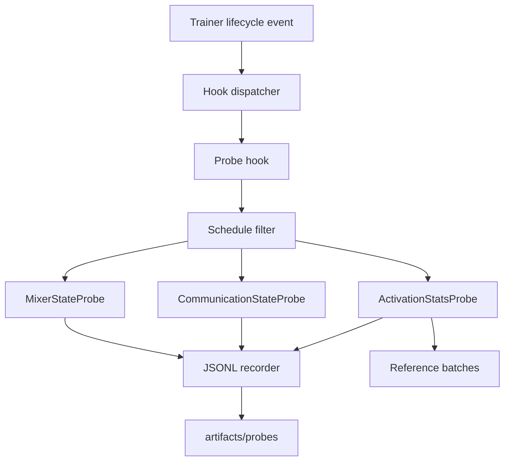

# Training Observability and Probe System Specification

## Status

**Proposed v2: two-tier probe system.**

This specification defines an extensible hook and probe system for recording model-state trajectories during training. The v1 design (epoch-boundary parameter snapshots of a single module type) could not answer the questions it was written for: the open multi-head LSTM questions depend on *activation* trajectories (actual injected message magnitudes, mixing displacement) and on *which* modules are observed (dense `nn.Linear` communication, gated latent communication, unconstrained and doubly stochastic mixers).

v2 keeps the v1 skeleton — trainer hook lifecycle, JSONL recorder, envelope, manifest, resume behavior — and adds:

1. **Two probe tiers**: parameter-state probes (no data dependency) and activation probes (data-dependent, run on a deterministic reference forward pass).
2. **Named-pattern discovery**: probes select modules by module-path patterns instead of by type alone.
3. **Diagnostic module API**: modules expose their internal tensors through public methods; probes never reimplement module internals.
4. **Flexible sampling schedules**: explicit epoch lists in addition to `every_n_epochs`, so early training can be sampled densely.
5. **Gradient-norm snapshots**: epoch-end `param.grad` norms for communication parameters, at no trainer cost.

Asynchronous capture, background workers, dashboards, activation-graph tracing, and full per-batch probes remain deferred. The synchronous MVP records at epoch boundaries; the reference forward pass runs once per sampled epoch on a small fixed batch set, which is negligible relative to training for the current models.

---

## 1. Goals

1. Provide a **generic training hook lifecycle** independent of model family and task.
2. Make probes **pluggable by registry name** and configurable from a run configuration.
3. Keep probes **read-only**: they must not mutate model, optimizer, scheduler, gradients, or training data, and must restore any transient state they change (for example `model.training` mode).
4. Persist probe outputs as **append-only, structured, auditable records** separate from training metrics.
5. Observe **parameters and activations**: parameter-state probes capture learned matrices and derived quantities; activation probes capture statistics of intermediate tensors on a fixed reference input set.
6. Select observed modules by **named pattern**, so shared mixers, per-layer mixers, dense communication blocks, and latent communication blocks are all observable without model-specific branches.
7. Record initial, periodic, and final state so the complete trajectory can be reconstructed, with schedules that can **sample the early phase densely**.
8. Preserve current training behavior when observability is not configured.

---

## 2. Non-goals for the MVP

The following are intentionally out of scope:

- asynchronous execution, queues, worker threads, or background GPU copies;
- per-batch probes (sampling inside the training or validation loop);
- gradient *tracing* (per-layer gradient activation maps); only epoch-end `param.grad` norm snapshots are included;
- interventions: freezing, resetting, or otherwise modifying communication parameters during training;
- visualization/dashboard infrastructure;
- changing the semantics of `metrics.jsonl` or checkpoint files.

The public hook, probe, and record schemas must allow an asynchronous implementation and an intervention system later without changing probe configuration or persisted record schemas.

---

## 3. Terminology

| Term | Meaning |
|---|---|
| **Hook** | Object subscribed to trainer lifecycle events. A hook may emit artifacts, checkpoints, metrics, or invoke one or more probes. |
| **Probe** | Read-only plugin that extracts a JSON-serializable observation from a `HookContext`. |
| **Probe tier** | Parameter-state (no data) or activation (data-dependent) probe family. |
| **Named pattern** | Glob-like module-path pattern such as `latent_communications.*` used to select observed modules. |
| **Probe point** | A concrete resolved module path matched by a named pattern. |
| **Diagnostic module** | A module that exposes internal tensors through a public `diagnostics()` method. |
| **Reference forward** | A deterministic `eval`-mode forward pass over a fixed reference batch set, run by activation probes. |
| **Recorder** | Component that persists probe records to a run artifact journal. |
| **Probe record** | One append-only JSON object for one probe at one lifecycle event. |
| **Probe schedule** | Policy that determines which events a probe samples. |
| **Phase** | Lifecycle label such as `fit_start`, `epoch_end`, or `fit_end`. |

---

## 4. Architecture



Component responsibilities:

| Component | Responsibility | Must not do |
|---|---|---|
| `Trainer` | Emits lifecycle events and provides current training state. | Know probe names, JSON schemas, or run paths. |
| Hook dispatcher | Calls registered hooks in deterministic order. | Perform model-specific analysis. |
| Probe hook | Applies schedules, supplies the reference batch set, invokes probes. | Know experiment-specific model architecture. |
| Probe | Reads module state and returns observations. | Write files, mutate state, or depend on `train.py`. |
| Reference provider | Builds the fixed reference batch set from a configured split. | Shuffle, mutate loaders, or use training data. |
| Recorder | Appends valid records to an artifact journal. | Inspect model internals. |

---

## 5. Trainer hook lifecycle

### 5.1 Hook protocol

```python
class TrainingHook(Protocol):
    def on_fit_start(self, context: HookContext) -> None: ...
    def on_epoch_end(self, context: HookContext) -> None: ...
    def on_fit_end(self, context: HookContext) -> None: ...
```

The MVP defines only these three events.

| Event | Timing | Required use |
|---|---|---|
| `on_fit_start` | Immediately before the first training epoch. | Record initial model state; lazily build reference batches. |
| `on_epoch_end` | After train epoch, validation, and applicable scheduler step have completed. | Periodic trajectory sampling. |
| `on_fit_end` | After the final successful epoch, before the training command returns. | Record final state. |

Failure hooks, epoch-start hooks, batch hooks, checkpoint hooks, and validation hooks may be added later. They must be additive API changes.

### 5.2 Hook context

```python
@dataclass(frozen=True)
class HookContext:
    model: nn.Module
    optimizer: Optimizer
    scheduler: Scheduler | None
    epoch: int | None
    global_step: int
    result: EpochResult | None
    phase: ProbePhase
    reference_batches: Sequence[Batch] | None = None
```

Rules:

- `epoch` is internally zero-based when present.
- Persisted records use **one-based** epoch numbers.
- At `fit_start`, `epoch` is `None` and persisted epoch is `0`.
- At `on_epoch_end`, `result` is the completed `EpochResult`.
- At `on_fit_end`, `result` is the final `EpochResult`.
- `reference_batches` is populated by the probe hook at `fit_start` from the **run-level** `observability.reference` configuration (§6.5), and is non-null only when at least one activation probe is configured. All activation probes share the same reference batch set; parameter-state probes ignore it.
- Hooks must receive the original uncompiled model where possible. If model compilation prevents named-module discovery, the implementation must document the behavior or reject incompatible probes clearly.

### 5.3 Compatibility with existing callback API

`Trainer.on_epoch_end` remains supported during migration. The trainer adapts it to a legacy callback **after** configured hooks run: probe records for epoch N are written before the epoch-N metrics and checkpoint handling. When `hooks=[]`, training behavior is unchanged. The MVP must not require refactoring run-management logic into hooks.

---

## 6. Probe framework

### 6.1 Probe protocol

```python
class Probe(Protocol):
    name: str

    def collect(self, context: HookContext) -> Mapping[str, JSONValue] | None:
        """Return JSON-serializable payload, or None when no observation exists."""
```

Probe contract:

1. Execute under `torch.no_grad()`.
2. Save and restore `model.training` mode around any forward pass; activation probes run in `eval` mode.
3. Do not mutate tensors, parameters, buffers, optimizer state, scheduler state, gradients, or RNG state. RNG state may be consumed only by the reference provider at `fit_start`, never by probes.
4. Return only JSON-compatible values: objects, arrays, strings, finite numbers, booleans, and `null`. Non-finite statistics (for example a zero denominator) are recorded as `null`, never as `nan`/`inf`.
5. Convert tensors to detached CPU values before returning.
6. Raise a clear error when configured with incompatible models unless configuration explicitly permits no matches.

### 6.2 Named-pattern discovery

Probes select modules by **named patterns** applied to `model.named_modules()` paths. A pattern is a glob string (`*`, `?`, `[...]`), or a list of patterns. Matching is on the dotted path, for example:

| Model form | Example patterns | Expected matches |
|---|---|---|
| Shared mixer | `mixer` | `mixer` |
| Distinct per-layer mixers | `mixers.*` | `mixers.0`, `mixers.1` |
| Dense communication (exp86) | `communications.*` | `communications.0` |
| Latent communication (exp87) | `latent_communications.*` | `latent_communications.0` |

Rules:

- Discovery **deduplicates by object identity**: a backwards-compatible alias such as `model.mixer = model.mixers[0]` exposes one module under multiple names and must produce one entry per unique object, named by the **canonical longest path**.
- `require_match: true` (default) fails at `fit_start` when a pattern matches nothing.
- A pattern that matches a module whose type is not supported by the probe fails at `fit_start` with the module path and expected type(s).
- Patterns are matched against the uncompiled model. If a probe must run on a compiled model, the probe documents its resolution order.

### 6.3 Diagnostic module API

Modules that must expose internal tensors to activation probes implement a public diagnostics method. The convention:

```python
class DiagnosableModule(Protocol):
    def diagnostics(self, *inputs: Tensor) -> Mapping[str, Tensor]:
        """Return named intermediate tensors for observability. Read-only."""
```

| Module | Method signature | Contract |
|---|---|---|
| `DoublyStochasticMixer` / `UnconstrainedMixer` | `diagnostics(channels)` | Returns `{"input", "output", "mixing_matrix"}`. |
| `HeadLatentCommunication` | `diagnostics(states)` | Returns `{"states", "latents", "messages", "decoded", "gated_messages"}` where `gated_messages = gates * decoded`. |

Rules:

- Probes obtain intermediates **only** through `diagnostics()` or existing public methods such as `mixing_matrix()`, `routing_weights()`, and `gates()`. Probes must never reimplement module internals.
- `diagnostics()` must be side-effect free: no gradient tracking, no buffer mutation, no RNG consumption, and it must behave identically under `torch.no_grad()`.
- The method may recompute the forward path; it is the module's own implementation and must stay consistent with `forward()`.
- For modules without a diagnostics method, activation probes may still use forward hooks to compute generic input/output statistics (see `io-stats` in §7.3).

### 6.4 Schedules

Each probe selects its sampling epochs. Two mutually exclusive forms:

```yaml
every_n_epochs: 1
```

or

```yaml
epochs: [1, 2, 3, 5, 10, 25, 50, 100, 250, 500, 750, 1000]
```

| Option | Default | Meaning |
|---|---:|---|
| `every_n_epochs` | — | Positive integer; record when the one-based completed epoch is divisible by it. |
| `epochs` | — | Explicit ascending list of one-based epochs to sample. Must be strictly increasing positive integers. |
| `include_initial` | `true` | Write a `fit_start` record. |
| `include_final` | `true` | Write a `fit_end` record even when the final epoch was already sampled. |

Validation:

- Exactly one of `every_n_epochs` and `epochs` must be provided.
- `epochs` entries must be strictly increasing; duplicate or non-positive entries are configuration errors.
- The schedule applies to `epoch_end` only; `fit_start`/`fit_end` records are governed by `include_initial`/`include_final`.
- The `epochs` list is **not** clamped to the training budget: entries beyond the final epoch are simply never sampled.

The explicit-list form exists because the questions of interest concentrate in early training: for example `exp81`'s mixer stabilized by epoch 219, so sampling `[1, 2, 3, 5, 10, 25, 50, 100, 250, 500, 750, 1000]` records the decisive phase densely while keeping the journal small.

### 6.5 Reference forward

Activation probes require a deterministic input set. The reference configuration is **run-level**, declared next to `probes` so that every activation probe in a run evaluates the same input set:

```yaml
observability:
  reference:
    split: val
    batches: 8
    selection: first
  probes:
    - name: activation-stats
      # ...
```

| Option | Default | Meaning |
|---|---:|---|
| `split` | `val` | Split to draw reference batches from: `val` or `test`. |
| `batches` | `8` | Number of batches to capture. Must be positive. |
| `selection` | `first` | Only `first` in the MVP: iterate the split loader and take the first `batches` batches. |

Rules:

- The reference batch set is built **once** at `fit_start` and cached for the run. All sampled epochs evaluate the same inputs, so statistics are comparable across the trajectory.
- The provider must not shuffle and must not touch the training split. Iterating the loader consumes the first `batches` batches of one pass; this must not consume from a loader that the trainer later reuses. The implementation must iterate a fresh iterator or a dedicated loader.
- **Loader wiring**: the training entry point (not the hook) owns the data module, so it injects a reference provider factory into the probe hook at construction. The factory takes a split name and returns a fresh loader iterator. A run with activation probes but no injected provider fails before training starts (§9).
- The manifest records the reference configuration **and** the split fingerprint from the run's dataset lock, so reference inputs are reproducible across runs.
- Reference batches are moved to the model device by the probe hook before each forward, and are released from the context after `on_fit_end`.
- `batches` is deliberately small: activation probes aggregate statistics over the captured batches and the full time dimension, so 4–8 batches is expected to suffice for the current models.
- A `split: test` reference on a dataset whose manifest omits a test split fails at `fit_start` with the same error class as an unavailable split.

### 6.6 Gradient-norm snapshots

Parameter-state probes may record gradient magnitudes for their matched modules:

| Option | Default | Meaning |
|---|---:|---|
| `include_grad_norms` | `false` | Record `L2` norm of `param.grad` for each observed parameter. |

Semantics (documented, not a bug):

- At `on_epoch_end` **and** `on_fit_end`, `param.grad` holds the gradient of the **last training batch** (the trainer zeroes gradients with `set_to_none=True` at the start of each batch and never zeroes after the final epoch's last step). The recorded value is therefore a **last-batch gradient snapshot**, useful for judging whether a parameter receives gradient flow and its rough magnitude, not an epoch-mean gradient. When `gradient_clip_norm` is configured, the recorded norm reflects the post-clip gradient.
- At `fit_start`, gradients are `None` and the field is recorded as `null`.
- Gradient tracing (per-layer activation maps, epoch-mean gradient norms) is deferred; this option must not grow into a trainer-side accumulator in the MVP.

---

## 7. Probe plugins

### 7.1 `mixer-state` (parameter tier)

Observes `DoublyStochasticMixer` and `UnconstrainedMixer` modules. Required for the shared-vs-distinct mixer trajectory questions (`exp73`/`exp79`/`exp80`/`exp81`/`exp84`/`exp77`).

```yaml
- name: mixer-state
  include: ["mixer", "mixers.*"]
  every_n_epochs: 1
  include_initial: true
  include_final: true
  include_matrix: true
  include_logits: true
  include_grad_norms: true
  require_match: true
```

| Option | Default | Meaning |
|---|---:|---|
| `include` | `["mixer", "mixers.*"]` | Named patterns. |
| `include_matrix` | `true` | Include the complete projected matrix. |
| `include_logits` | `true` | Include the raw logits matrix (pre-Sinkhorn). Required because Sinkhorn projection can saturate: logits may move substantially while the projected matrix barely changes. |
| `include_grad_norms` | `false` | Last-batch gradient norm snapshots (§6.6). |
| `require_match` | `true` | Fail at `fit_start` if no pattern matches. |

For `N > 16`, `include_matrix` defaults to `false` instead (summary-only).

Per-module payload, for `P = mixing_matrix()` and logits `L`:

```json
{
  "module": "mixers.0",
  "type": "doubly_stochastic",
  "shape": [4, 4],
  "matrix": [[0.999889, 0.000026, 0.000043, 0.000042], [0.000029, 0.999927, 0.000044, 0.000047], [0.000041, 0.000023, 0.999880, 0.000050], [0.000036, 0.000024, 0.000037, 0.999861]],
  "logits": [[10.02, -0.18, -0.11, -0.13], [-0.16, 10.01, -0.12, -0.15], [-0.14, -0.20, 10.00, -0.17], [-0.12, -0.15, -0.13, 10.01]],
  "frobenius_distance_to_identity": 0.00026216,
  "spectral_distance_to_identity": 0.00017733,
  "max_abs_distance_to_identity": 0.00013947,
  "off_diagonal_mass": 0.00044274,
  "diagonal_min": 0.999861,
  "diagonal_max": 0.999927,
  "logits_distance_to_initial": 0.52,
  "row_sum_max_error": 0.00000012,
  "column_sum_max_error": 0.00000012,
  "grad_norms": {"logits": 0.0004}
}
```

Field reference, for `P ∈ R^(N×N)` and identity `I`:

| Field | Definition |
|---|---|
| `frobenius_distance_to_identity` | `||P - I||_F` |
| `spectral_distance_to_identity` | `||P - I||_2` |
| `max_abs_distance_to_identity` | `max(abs(P - I))` |
| `off_diagonal_mass` | `Σ_{i != j} P[i, j]` |
| `diagonal_min` / `diagonal_max` | extrema of `diag(P)` |
| `logits_distance_to_initial` | `||L - L_initial||_F`, where `L_initial` is the logits captured at `fit_start` (therefore `0` in the `fit_start` record). Measures how far the raw logits moved, independent of Sinkhorn saturation. |
| `row_sum_max_error` / `column_sum_max_error` | maximum absolute deviation of `P` row/column sums from `1` |
| `grad_norms` | mapping of parameter name to last-batch gradient `L2` norm, present only when `include_grad_norms: true`; keys cover every trainable parameter of the module (`logits` for `DoublyStochasticMixer`) |

`UnconstrainedMixer` uses the same schema with `type: "unconstrained"`; `logits`, `logits_distance_to_initial`, `row_sum_max_error`, and `column_sum_max_error` are `null` for it, and `grad_norms` uses its parameter name `weight`.

### 7.2 `communication-state` (parameter tier)

Observes dense inter-layer communication blocks (exp86: `nn.Linear`) and gated latent communication blocks (exp87: `HeadLatentCommunication`).

```yaml
- name: communication-state
  include: ["communications.*", "latent_communications.*"]
  every_n_epochs: 1
  include_grad_norms: true
  head_dim: 8
```

| Option | Default | Meaning |
|---|---:|---|
| `include` | required | Named patterns for communication modules. |
| `head_dim` | `null` | Feature width per head for block partitioning. When omitted, the probe reads `model.head_dim` if present; otherwise dense blocks emit overall statistics only. |
| `include_grad_norms` | `false` | Last-batch gradient norm snapshots (§6.6). |
| `require_match` | `true` | Fail at `fit_start` if no pattern matches. |

#### Dense blocks (`nn.Linear`)

For weight `W ∈ R^(H×H)` with `H = num_heads × head_dim`, the payload partitions `W` into `num_heads × num_heads` blocks of size `head_dim × head_dim`:

```json
{
  "module": "communications.0",
  "type": "dense_linear",
  "shape": [32, 32],
  "weight_frobenius_norm": 4.93,
  "bias_norm": 0.2162,
  "frobenius_distance_to_identity": 2.4334,
  "spectral_distance_to_identity": 1.9296,
  "max_abs_distance_to_identity": 0.5379,
  "block_diagonal_deviation_norm": 0.536,
  "block_cross_norm_mean": 0.610,
  "block_cross_norm_max": 1.043,
  "grad_norms": {"weight": 0.003, "bias": 0.001}
}
```

Field reference:

| Field | Definition |
|---|---|
| `block_diagonal_deviation_norm` | mean over diagonal blocks of `||W_ii - I||_F` |
| `block_cross_norm_mean` / `block_cross_norm_max` | mean / max over off-diagonal blocks of `||W_ij||_F` |

These are the quantities reported manually for exp86; the probe reproduces them at every sampled epoch.

#### Latent blocks (`HeadLatentCommunication`)

```json
{
  "module": "latent_communications.0",
  "type": "latent_communication",
  "routing": [[0.000000, 0.221056, 0.530484, 0.248459], [0.217126, 0.000000, 0.605853, 0.177021], [0.315508, 0.339333, 0.000000, 0.345159], [0.226404, 0.274482, 0.499114, 0.000000]],
  "routing_entropy_per_receiver": [1.0159, 0.9417, 1.0979, 1.0380],
  "routing_uniformity_distance": 0.327,
  "gate_min": 0.00614,
  "gate_mean": 0.00728,
  "gate_max": 0.00952,
  "encoder_weight_norm": 0.83,
  "decoder_weight_norm": 1.21,
  "grad_norms": {"routing_logits": 0.002, "gate_logits": 0.0005, "encoders.0.1.weight": 0.001, "decoders.0.0.weight": 0.0008}
}
```

Field reference, for routing `α` (receiver-by-source, self masked), gates `g`, and uniform routing `u` over the `N - 1` non-self sources:

| Field | Definition |
|---|---|
| `routing` | `routing_weights()` matrix |
| `routing_entropy_per_receiver` | Shannon entropy (nats) of each receiver row of `α` |
| `routing_uniformity_distance` | mean over receivers of `||α_i - u||_1` |
| `gate_min` / `gate_mean` / `gate_max` | statistics of `gates()` |
| `encoder_weight_norm` / `decoder_weight_norm` | sum of `L2` norms over the module's encoder / decoder linear weights |
| `grad_norms` | mapping of **every** trainable `named_parameters` entry of the module to its last-batch gradient `L2` norm, flattened names included (encoders/decoders included); example shows representative entries |

### 7.3 `activation-stats` (activation tier)

Observes intermediate-tensor statistics on the reference forward. This tier answers the questions parameter snapshots cannot: the actual injected message magnitude for `HeadLatentCommunication` and the actual mixing displacement for mixers.

```yaml
- name: activation-stats
  points:
    - path: "latent_communications.*"
      quantity: "message-magnitude"
    - path: "fusion"
      quantity: "io-stats"
  every_n_epochs: 1
  require_match: true
```

`points` are selected per model family: a run configures only the points whose modules exist in that run's model (see §11 Phase 5 for per-family blocks). With the default `require_match: true`, a point whose pattern matches nothing fails at `fit_start`, so a single config must not mix points for mutually exclusive model families.

| Option | Default | Meaning |
|---|---:|---|
| `points` | required | List of probe points; each entry has `path` (named pattern) and `quantity`. |
| `require_match` | `true` | Fail at `fit_start` if any point pattern matches nothing. |
| `every_n_epochs` / `epochs` / `include_initial` / `include_final` | as §6.4 | Schedule. |

The reference configuration is **not** part of the probe block; it is the run-level `observability.reference` block (§6.5).

Execution protocol for one sampled epoch:

1. The probe hook ensures `model.eval()` under `torch.no_grad()`, and restores the previous `training` mode afterwards.
2. For each probe point, the probe registers a forward hook on every matched module; the hook captures the module's input tensors.
3. Each reference batch is moved to the model device and the model is invoked **exactly once per batch**. Inside the forward pass, each hook synchronously computes the point's statistics under `no_grad`: for `diagnostics`-based quantities it calls `module.diagnostics(captured_inputs)` and reduces the returned tensors; for `io-stats` and `dense-displacement` it reduces the captured input and output directly.
4. Statistics are aggregated over batches and over the batch/time dimensions; raw tensors are never persisted.

The forward hook is the **sole input-capture mechanism**: `diagnostics()` never replaces the hook, it is called from it. Because `diagnostics()` recomputes the module's forward path, modules with diagnostics quantities are executed twice per reference forward — once by the model, once inside the hook — both under `no_grad()`. For the current models this doubles a negligible fraction of the work.

Quantity reference:

| Quantity | Required module API | Per-module payload |
|---|---|---|
| `message-magnitude` | `HeadLatentCommunication.diagnostics(states)` | `injection_ratio` per receiver: mean over `(B, T)` of `||g_i ⊙ decoded_i||_2 / ||states_i||_2`; `decoded_ratio` per receiver: mean of `||decoded_i||_2 / ||states_i||_2`; `gated_message_norm` overall mean of `||g ⊙ decoded||_2`. |
| `mixing-displacement` | `DoublyStochasticMixer`/`UnconstrainedMixer` `diagnostics(channels)` | `displacement_ratio` overall mean of `||output - input||_2 / ||input||_2`; `displacement_ratio_per_head`; `input_norm` overall mean of `||input||_2`. |
| `dense-displacement` | none (forward hook on `nn.Linear` communication blocks) | `displacement_ratio` overall mean of `||W x + b - x||_2 / ||x||_2`; `output_norm`; `input_norm`. Identity initialization makes the baseline ≈ `0`. |
| `io-stats` | none (forward hook on module input/output) | `input_norm` / `output_norm` overall mean of `L2` norms; `input_mean_abs` / `output_mean_abs`. |

Example payload for `message-magnitude` on a 4-head latent block:

```json
{
  "module": "latent_communications.0",
  "quantity": "message-magnitude",
  "injection_ratio_per_receiver": [0.0019, 0.0021, 0.0017, 0.0023],
  "injection_ratio_mean": 0.002,
  "decoded_ratio_per_receiver": [0.281, 0.295, 0.240, 0.312],
  "decoded_ratio_mean": 0.282,
  "gated_message_norm": 0.011
}
```

Example payload for `mixing-displacement` on the shared 4-head mixer:

```json
{
  "module": "mixer",
  "quantity": "mixing-displacement",
  "input_norm": 2.83,
  "displacement_ratio": 0.00015,
  "displacement_ratio_per_head": [0.00012, 0.00018, 0.00014, 0.00016]
}
```

`injection_ratio` is the direct measurement requested for exp87: it separates the gate's effect from the decoder's rescaling, because `decoded_ratio` measures the message magnitude *before* the gate. `mixing-displacement` is the direct measurement for the "small perturbations amplified recurrently" tension in the mixer discussion: with a near-identity `P`, `||P h - h|| / ||h||` is small, and its trajectory shows whether the mixer's *actual effect on states* ever grew during training.

Aggregation rules:

- All ratios are computed per `(batch, time)` element first, then reduced with **mean** over the reduced dimensions; `_mean`-suffixed fields additionally aggregate over receivers.
- A zero denominator (a fully zero head state) yields `null` for that element before reduction; if every element is `null`, the field is `null`.
- `include_initial: true` records activation statistics on the freshly initialized model; this is the baseline every later epoch is compared against. On a resumed run, the `fit_start` record reflects the restored state instead (see §8.4).

---

## 8. Persistence

### 8.1 File layout

Probe artifacts are created lazily only when observability is enabled:

```text
runs/expNN/
└── artifacts/
    └── probes/
        ├── manifest.json
        ├── mixer-state.jsonl
        ├── communication-state.jsonl
        └── activation-stats.jsonl
```

`metrics.jsonl` remains exclusively for train/validation metrics.

### 8.2 Manifest

`artifacts/probes/manifest.json` is written when the probe system starts and contains the resolved configuration **plus** reproducibility anchors. The example below is for a latent-communication run (exp87 family); each run records only the modules its model actually contains:

```json
{
  "schema_version": 2,
  "reference": {
    "split": "val",
    "batches": 8,
    "selection": "first",
    "split_fingerprint": "sha256:…",
    "first_batch_shapes": {"latent_communications.0": [2048, 256, 4, 8], "fusion": [2048, 256, 32]}
  },
  "probes": [
    {
      "name": "communication-state",
      "schedule": {"every_n_epochs": 1, "include_initial": true, "include_final": true},
      "options": {"include_grad_norms": true, "require_match": true, "head_dim": 8},
      "patterns": ["latent_communications.*"],
      "matched_modules": ["latent_communications.0"]
    },
    {
      "name": "activation-stats",
      "schedule": {"every_n_epochs": 1, "include_initial": true, "include_final": true},
      "options": {"require_match": true},
      "points": [
        {"pattern": "latent_communications.*", "quantity": "message-magnitude", "matched_modules": ["latent_communications.0"]},
        {"pattern": "fusion", "quantity": "io-stats", "matched_modules": ["fusion"]}
      ]
    }
  ]
}
```

Rules:

- `reference` is present only when at least one activation probe is configured; it is the run-level block from §6.5.
- The manifest describes the requested **and resolved** configuration: `matched_modules` and `reference.split_fingerprint` are written at `fit_start` once discovery and reference capture succeed.
- `split_fingerprint` is read from the run's dataset lock for the referenced split.
- `first_batch_shapes` records the tensor shape of the **first captured reference batch** per probe-point module (a single batch, whose leading dimension is the loader's batch size; `2048` matches the current experiments' batch size), so analysis can verify input size assumptions.
- For `activation-stats`, the manifest records resolved **points** (`pattern` → `quantity` → concrete `matched_modules`), not a flat pattern list, because each point's quantity is part of the configuration.

### 8.3 JSONL record envelope

Every record has the following common envelope:

```json
{
  "schema_version": 2,
  "probe": "activation-stats",
  "phase": "epoch_end",
  "epoch": 50,
  "global_step": 500,
  "payload": {}
}
```

Rules:

- `epoch` is user-facing and one-based; `fit_start` uses `0`.
- `global_step` is the trainer counter at observation time.
- `phase` is one of `fit_start`, `epoch_end`, `fit_end`.
- The envelope is owned by the probe hook; individual probes only return `payload`.
- Records are append-only, flushed, and `fsync`ed after each successful write for research/audit durability.
- A `fit_end` record is written even when the final epoch was already sampled; the distinct `phase` makes this intentional rather than duplicate ambiguity.

### 8.4 Resume behavior

Probe journals are append-only across resumed training. A resumed run may produce another `fit_start` event at a nonzero global step; that record's payload reflects the **restored** model state, not the original initialization, so analysis must treat `phase: fit_start` with `global_step > 0` accordingly. Reference batches are rebuilt at each `fit_start` from the same configuration; because capture is deterministic (`selection: first` on a locked split), the rebuilt set equals the original and later records remain comparable.

Analysis tools must identify a record by:

```text
(probe, phase, epoch, global_step)
```

If a resumed run creates duplicate keys, readers retain the last record. The MVP does not rewrite or deduplicate existing journals during training.

---

## 9. Error handling

Configured probe failures are significant because missing probe data can invalidate an experiment interpretation.

| Situation | Behavior |
|---|---|
| Invalid probe configuration | Fail before training starts. |
| Unknown probe name | Fail before training starts. |
| Pattern matches no module and `require_match: true` | Fail at `fit_start`. |
| Pattern matches a module of unsupported type | Fail at `fit_start` with module path and expected types. |
| `epochs` list not strictly increasing, or both `every_n_epochs` and `epochs` given | Fail before training starts. |
| Activation probes configured without an injected reference provider | Fail before training starts. |
| Reference split unavailable or yields fewer than `batches` batches | Fail at `fit_start`. |
| `diagnostics()` returns an unknown tensor name for the requested quantity | Fail at `fit_start` with probe and quantity context. |
| Probe returns non-JSON data | Fail immediately with probe and field context. |
| Non-finite statistic (zero denominator everywhere) | Record `null`, never fail. |
| Recorder write failure | Fail training; run is marked failed by normal run lifecycle. |
| No matching module and `require_match: false` | Write no observation; optional future warning support. |

A non-fatal `failure_policy: warn` may be added later, but should not be part of the first implementation.

---

## 10. Proposed module layout

```text
goldfish/observability/
├── __init__.py
├── events.py        # HookContext, ProbePhase, TrainingHook, EpochResult imports
├── hooks.py         # Hook dispatcher, ProbeHook, legacy callback adapter
├── probes.py        # Probe protocol, probe registry, schedule parsing
├── discovery.py     # Named-pattern discovery, identity deduplication
├── reference.py     # Reference batch provider and caching
├── recorder.py      # JSONL recorder and manifest writer
├── stats.py         # Tensor reduction helpers (norms, ratios, entropy, null handling)
├── mixer.py         # MixerStateProbe
├── communication.py # CommunicationStateProbe
└── activation.py    # ActivationStatsProbe
```

The design permits future additions without changing Trainer or run file schemas:

```text
goldfish/observability/
├── gradients.py     # Future: gradient tracing beyond param.grad snapshots
├── interventions.py # Future: freeze/reset/schedule intervention hooks
└── runtime.py       # Future asynchronous runtime
```

---

## 11. Integration plan

### Phase 1: hook plumbing

1. Add `TrainingHook` and `HookContext` (with `reference_batches`).
2. Add `hooks: Sequence[TrainingHook]` to `Trainer`.
3. Emit `fit_start`, `epoch_end`, and `fit_end`.
4. Preserve existing `on_epoch_end` behavior through a compatibility adapter.

### Phase 2: framework

1. Add the probe registry, schedule parsing, and named-pattern discovery.
2. Add the reference batch provider (`selection: first`) and the provider-factory injection point in the training entry point (a run with activation probes but no injected provider fails before training starts).
3. Add the JSONL recorder and manifest writer.
4. Parse and validate `observability.reference` and `observability.probes` in resolved training config.
5. Construct `ProbeHook` from the configured plugins.

### Phase 3: parameter-tier probes

1. Implement `MixerStateProbe` (logits + projected matrix + distances + grad norms).
2. Implement `CommunicationStateProbe` (dense block norms; latent routing/gates).
3. Add diagnostics methods to `DoublyStochasticMixer`, `UnconstrainedMixer`, and `HeadLatentCommunication` (`diagnostics()`), plus `mixing_matrix()`/`routing_weights()`/`gates()` already exist.
4. Add unit tests for shared/distinct discovery and identity deduplication.

### Phase 4: activation-tier probe

1. Implement `ActivationStatsProbe` with `message-magnitude`, `mixing-displacement`, `dense-displacement`, and `io-stats`.
2. Add unit tests for statistics, `null` handling, and training-mode restoration.
3. Add a small numeric integration test asserting initial, periodic, and final records for a `LatentCommunicationMultiHeadLSTMForecastModel`.

### Phase 5: enablement

Enable observability for the next seed-sweep experiments. Because the model families are mutually exclusive, the configuration is per family; a run applies the block matching its model:

```yaml
# Mixer family (exp73, exp77, exp79, exp80, exp81, exp84)
observability:
  reference: {split: val, batches: 8, selection: first}
  probes:
    - name: mixer-state
      every_n_epochs: 1
      include_grad_norms: true
    - name: activation-stats
      points:
        - {path: "mixer", quantity: "mixing-displacement"}
      every_n_epochs: 1
```

```yaml
# Dense communication family (exp86)
observability:
  reference: {split: val, batches: 8, selection: first}
  probes:
    - name: communication-state
      include: ["communications.*"]
      every_n_epochs: 1
      include_grad_norms: true
      head_dim: 8
    - name: activation-stats
      points:
        - {path: "communications.*", quantity: "dense-displacement"}
      every_n_epochs: 1
```

```yaml
# Latent communication family (exp87)
observability:
  reference: {split: val, batches: 8, selection: first}
  probes:
    - name: communication-state
      include: ["latent_communications.*"]
      every_n_epochs: 1
      include_grad_norms: true
      head_dim: 8
    - name: activation-stats
      points:
        - {path: "latent_communications.*", quantity: "message-magnitude"}
        - {path: "fusion", quantity: "io-stats"}
      every_n_epochs: 1
```

For dense and latent communication runs, prefer the early-dense schedule on the communication probes:

```yaml
epochs: [1, 2, 3, 5, 10, 25, 50, 100, 250, 500, 750, 1000]
```

---

## 12. Acceptance criteria for the MVP

1. A run with no `observability` configuration produces exactly the current run layout and training behavior.
2. A run with `mixer-state` enabled creates `artifacts/probes/manifest.json` and `mixer-state.jsonl`.
3. The journal contains a `fit_start` record at epoch `0`, periodic `epoch_end` records, and a `fit_end` record.
4. A shared-mixer model produces one mixer entry named `mixer`; a distinct-mixer model with `num_layers=2` produces `mixers.0` and `mixers.1`, with no duplicate alias entry.
5. `mixer-state` records both `logits` and projected `matrix`, and with `include_grad_norms: true` records `grad_norms.logits`.
6. `communication-state` on a dense model reproduces the exp86 block norms (`block_diagonal_deviation_norm`, `block_cross_norm_mean/max`); on a latent model it records routing, entropy, and gate statistics.
7. `activation-stats` with `message-magnitude` records `injection_ratio` and `decoded_ratio` per receiver on the reference set, and the values differ meaningfully between `fit_start` and late epochs for a latent-communication model.
8. `activation-stats` restores the model's `training` mode and leaves gradients and RNG state untouched.
9. An `epochs` list schedule samples exactly the listed epochs plus `fit_start`/`fit_end` per `include_*`.
10. The manifest contains resolved `matched_modules` (points with quantities for `activation-stats`), the run-level `reference` block, and `reference.split_fingerprint`.
11. All activation probes in one run share the single run-level reference batch set recorded in the manifest.
12. A run with activation probes but no injected reference provider fails before training starts.
13. All persisted values are valid JSON and finite or `null` where numeric.
14. Existing training, checkpoint, and metrics tests continue to pass.
15. From probe records alone, an analyst can answer: (a) whether each mixer stayed near identity or diverged, including a logits-vs-projected distinction; (b) the actual injected message magnitude trajectory for latent communication; (c) the actual mixing displacement trajectory; (d) whether communication parameters receive gradient flow at each sampled epoch.

---

## 13. Deferred asynchronous and intervention evolution

### 13.1 Asynchronous execution

A future `AsyncProbeHook` may replace the synchronous execution mechanism while preserving `TrainingHook` event names, `HookContext` semantics, probe configuration names, JSONL envelope and payload schemas, and artifact layout. When asynchronous execution becomes necessary, the training thread should only capture immutable snapshots and enqueue them; no worker may read mutable live model parameters directly.

### 13.2 Interventions

The hypotheses in `docs/multihead-lstm/HYPOTHESES.md` include interventions (freeze communication at epoch N, reset mixer to identity at mid-training, scheduled coupling). Interventions are deliberately out of scope for this spec: they mutate model state and therefore violate the read-only probe contract. A future `interventions` system must:

- run on the same trainer hook lifecycle with its own `TrainingHook` implementations;
- persist an intervention event record in `artifacts/probes/interventions.jsonl` with the same envelope, so probe trajectories can be aligned with intervention points;
- remain additive: no probe configuration changes are required to observe an intervened run.

---

## 14. Relationship to existing documentation

- `docs/multihead-lstm/HYPOTHESES.md` priority item 1 ("record `||gate ⊙ D(m)|| / ||h||`, routing, and gates through training") maps to `communication-state` (routing, gates) plus `activation-stats`/`message-magnitude` (`injection_ratio`).
- Priority item 5 (intermediate `exp79` mixer trajectory) maps to `mixer-state` with the early-dense `epochs` schedule.
- Priority item 3 (uniform-ratio sweep) and item 2 (seed sweep) only require observability enabled per run: the per-family configuration from §11 Phase 5 applies unchanged across seeds of the same model family.
- The exp86 block-norm analysis in `LAYERWISE_MIXING_EXPERIMENTS.md` is reproduced automatically by `communication-state` at every sampled epoch.
