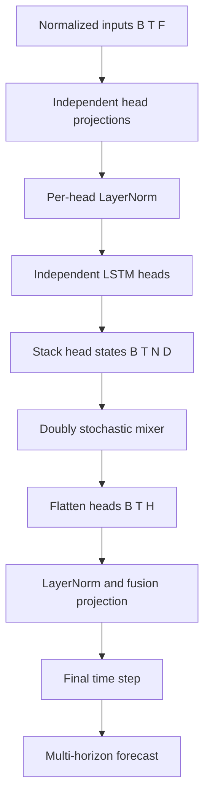

# Multi-head LSTM with Doubly Stochastic Mixing

This document records the design of Goldfish's `forecast/multihead-lstm` model and the observed behavior of LSTM layer dropout on the long-lookback Fourier forecasting experiment.

## Goals

The model is intended to give a numeric forecasting model multiple independent recurrent state spaces without allowing one head to arbitrarily amplify, suppress, or monopolize the others during fusion.

It combines:

1. several parallel LSTM heads that can learn complementary temporal features;
2. a learned doubly stochastic matrix that routes information between heads under conservation constraints;
3. a learned fusion projection that turns the mixed head states into the final forecast representation.

The intended use cases include time series containing several concurrent behaviors, such as short-term variation, trend, phase, and periodic components.

## Architecture

Given normalized input features:

```text
inputs: [B, T, F]
```

and model configuration:

```text
N = num_heads
D = hidden_dim / N
H = hidden_dim
```

where `H` must be divisible by `N`, the data flow is:



For each head `i`:

```text
z_i = LayerNorm_i(Linear_i(inputs))
h_i = LSTM_i(z_i)
```

The states are stacked:

```text
head_states: [B, T, N, D]
```

The mixer applies a matrix `M` with shape `[N, N]`:

```text
mixed[b, t, output_head] = Σ_input_head M[output_head, input_head]
                                  × head_states[b, t, input_head]
```

The mixed heads are concatenated and fused:

```text
representations = Fusion(flatten(mixed_heads))  # [B, T, H]
forecast = ForecastHead(representations[:, -1])
```

The output follows the common forecast contract:

```text
forecast: [B, horizon_count, target_count]
representations: [B, T, hidden_dim]
```

## Why independent LSTM heads

Each head has its own input projection, normalization, and LSTM parameters. This is deliberately different from splitting a single LSTM hidden state into chunks: independent heads can specialize in distinct temporal filters and recurrent dynamics.

The implementation executes individual `nn.LSTM` modules per head. A Python-level head loop remains because each head has separate parameters and PyTorch's fused `nn.LSTM` interface does not natively accept a separate head dimension with independent parameter sets.

For a small head count, such as `4` or `8`, preserving PyTorch's optimized LSTM kernels is preferable to a custom hand-written LSTM that only eliminates the head loop while introducing a time-step loop and losing fused backend behavior.

## Doubly stochastic mixer

`DoublyStochasticMixer` learns logits for an `N × N` matrix and uses log-space Sinkhorn normalization to project them onto the Birkhoff polytope.

The projected matrix satisfies approximately:

```text
M[i, j] >= 0
Σ_j M[i, j] = 1    for every output head i
Σ_i M[i, j] = 1    for every input head j
```

### Consequences

- Every output head is a convex combination of source heads.
- A source head has total contribution `1` across all output heads.
- The mean across heads is preserved:

  ```text
  mean(M × heads, head_dimension) = mean(heads, head_dimension)
  ```

- The mixer cannot use unconstrained negative cancellation.
- It cannot globally inflate all head activations through its mixing matrix alone.
- It starts near the identity matrix, allowing training to begin near independent-head behavior.

The mixer is static for a model instance. It is not input-conditioned attention: all examples and time positions share the same learned routing matrix. Its parameters still receive gradients through all batches and time positions.

### Readout constraint

A simple mean over heads after the mixer makes the mixer ineffective because double stochasticity preserves that mean. The model therefore uses:

```text
mixed heads → flatten → learned fusion projection
```

rather than mean pooling.

## Dropout analysis

The model exposes `dropout` through `nn.LSTM(..., dropout=dropout)`. In PyTorch this is **inter-layer LSTM dropout**, not recurrent-state dropout, input dropout, mixer dropout, or forecast-head dropout.

### Single-layer LSTM: no effective dropout

PyTorch only applies LSTM dropout between stacked recurrent layers. Therefore:

```text
num_layers = 1
```

means the LSTM dropout setting has no effect. A non-zero value in this case creates a misleading configuration: it appears to regularize the model but does not change LSTM training behavior.

Profiles should use:

```yaml
num_layers: 1
dropout: 0.0
```

for clarity.

### Multi-layer LSTM: noisy mixer inputs

For:

```text
num_layers >= 2
```

LSTM dropout perturbs the representation passed from one LSTM layer to the next. Each independent head then emits a state sequence influenced by this layerwise noise, and the doubly stochastic mixer receives the resulting noisy head states:

```text
LSTM layer 1
→ inter-layer dropout
→ LSTM layer 2
→ head states
→ doubly stochastic mixer
```

This is an awkward regularization point for this architecture:

- The meaningful recurrent path is disrupted before a head produces its final temporal representation.
- The static mixer learns from head activations that are noisier during training than at evaluation.
- The mixer cannot dynamically reroute around per-example or per-step dropout noise because its routing matrix is global and static.
- The initial input LayerNorm does not normalize the layer-to-layer activations affected by LSTM dropout.

The exact dropout mask behavior is backend-dependent and should not be assumed to be a stable public PyTorch API guarantee. The important architectural fact is that dropout changes the distribution of final head states seen by the mixer during training.

## Observed Fourier long-lookback experiment

The following runs use the same `data/fourier-lb256` dataset and the same core configuration:

```text
family: forecast
name: multihead-lstm
hidden_dim: 128
num_layers: 2
num_heads: 8
sinkhorn_iterations: 20
optimizer: AdamW
learning_rate: 0.001
weight_decay: 0.0001
scheduler: cosine, T_max=500
batch_size: 2048
```

The intentional difference is LSTM inter-layer dropout.

| Run | Dropout | Best validation loss | Best epoch | Latest observed validation loss |
|---|---:|---:|---:|---:|
| `exp74` | `0.05` | `0.09536` | `154` | `0.13923` at epoch `498` |
| `exp75` | `0.00` | `0.04477` | `385` | `0.04666` at epoch `448` |

Selected trajectories:

| Epoch | `exp74` train / validation loss | `exp75` train / validation loss |
|---:|---:|---:|
| 10 | `0.24570 / 0.28892` | `0.23821 / 0.28469` |
| 20 | `0.21689 / 0.25917` | `0.20729 / 0.24650` |
| 50 | `0.11065 / 0.20400` | `0.11758 / 0.14072` |
| 100 | `0.06477 / 0.12100` | `0.03996 / 0.07141` |
| 200 | `0.03507 / 0.11740` | `0.01974 / 0.04937` |
| 400 | `0.01634 / 0.13582` | `0.01049 / 0.04832` |

### Interpretation

The `dropout=0.05` run reaches its best validation result much earlier, then its training loss continues falling while validation loss worsens. The `dropout=0.0` run converges to substantially lower training and validation loss and remains comparatively stable.

For this deterministic Fourier forecasting task, stable representation of phase and long-range periodic context appears more valuable than layerwise LSTM regularization. The observed effect is not a small training-speed tradeoff: the no-dropout run achieves less than half the best validation loss of the `0.05` run.

This is evidence for this dataset and configuration, not a universal claim that LSTM dropout is always harmful.

## Current recommendation

For the long-lookback Fourier multi-head LSTM baseline:

```yaml
hidden_dim: 128
num_layers: 2
dropout: 0.0
num_heads: 8
sinkhorn_iterations: 20
```

Do not use non-zero LSTM layer dropout by default for this architecture.

If additional regularization is needed after establishing a no-dropout baseline, prefer testing regularization after mixing rather than within the recurrent stack. A possible future design is to separate the current parameter into explicit controls:

```yaml
lstm_dropout: 0.0
fusion_dropout: 0.0
```

where fusion dropout would be applied after:

```text
mixer → flatten → LayerNorm → Linear
```

This keeps the recurrent temporal state construction and mixer input distribution intact while still allowing regularization of the final fused representation.

## Open questions

1. Does post-fusion dropout improve validation loss without degrading phase fidelity?
2. Would head-level dropout, which removes whole heads rather than intermediate LSTM features, be a better regularizer for the mixer?
3. Does dynamic, input-dependent mixing benefit from a different dropout strategy?
4. Does the dropout conclusion persist for noisy, non-deterministic, or lower-sample forecasting datasets?
5. Should the model constructor reject `num_layers=1` with non-zero LSTM dropout rather than silently accepting an ineffective setting?
