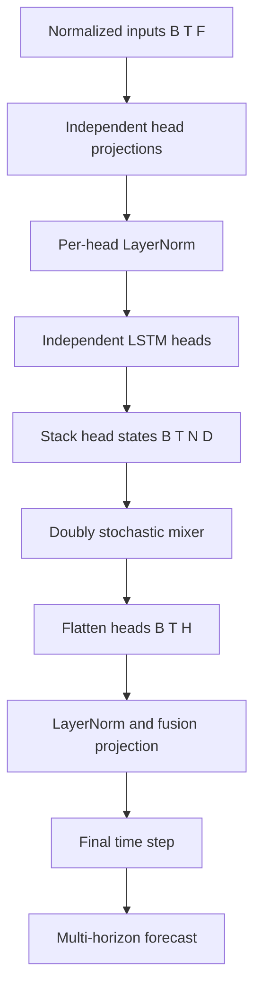

# Multi-head LSTM with Doubly Stochastic Mixing

This document records the design of Goldfish's `forecast/multihead-lstm` model and the observed behavior of LSTM layer dropout on the long-lookback Fourier forecasting experiment.

## Goals

The model is intended to give a numeric forecasting model multiple independent recurrent state spaces without allowing one head to arbitrarily amplify, suppress, or monopolize the others during fusion.

It combines:

1. several parallel LSTM heads that can learn complementary temporal features;
2. a learned doubly stochastic matrix that routes information between heads under conservation constraints;
3. a learned fusion projection that turns the mixed head states into the final forecast representation.

The intended use cases include time series containing several concurrent behaviors, such as short-term variation, trend, phase, and periodic components.

## Architecture

Given normalized input features:

```text
inputs: [B, T, F]
```

and model configuration:

```text
N = num_heads
D = hidden_dim / N
H = hidden_dim
```

where `H` must be divisible by `N`, the data flow is:



For each head `i`:

```text
z_i = LayerNorm_i(Linear_i(inputs))
h_i = LSTM_i(z_i)
```

The states are stacked:

```text
head_states: [B, T, N, D]
```

The mixer applies a matrix `M` with shape `[N, N]`:

```text
mixed[b, t, output_head] = Σ_input_head M[output_head, input_head]
                                  × head_states[b, t, input_head]
```

The mixed heads are concatenated and fused:

```text
representations = Fusion(flatten(mixed_heads))  # [B, T, H]
forecast = ForecastHead(representations[:, -1])
```

The output follows the common forecast contract:

```text
forecast: [B, horizon_count, target_count]
representations: [B, T, hidden_dim]
```

## Why independent LSTM heads

Each head has its own input projection, normalization, and LSTM parameters. This is deliberately different from splitting a single LSTM hidden state into chunks: independent heads can specialize in distinct temporal filters and recurrent dynamics.

The implementation executes individual `nn.LSTM` modules per head. A Python-level head loop remains because each head has separate parameters and PyTorch's fused `nn.LSTM` interface does not natively accept a separate head dimension with independent parameter sets.

For a small head count, such as `4` or `8`, preserving PyTorch's optimized LSTM kernels is preferable to a custom hand-written LSTM that only eliminates the head loop while introducing a time-step loop and losing fused backend behavior.

## Doubly stochastic mixer

`DoublyStochasticMixer` learns logits for an `N × N` matrix and uses log-space Sinkhorn normalization to project them onto the Birkhoff polytope.

The projected matrix satisfies approximately:

```text
M[i, j] >= 0
Σ_j M[i, j] = 1    for every output head i
Σ_i M[i, j] = 1    for every input head j
```

### Consequences

- Every output head is a convex combination of source heads.
- A source head has total contribution `1` across all output heads.
- The mean across heads is preserved:

  ```text
  mean(M × heads, head_dimension) = mean(heads, head_dimension)
  ```

- The mixer cannot use unconstrained negative cancellation.
- It cannot globally inflate all head activations through its mixing matrix alone.
- It starts near the identity matrix, allowing training to begin near independent-head behavior.

The mixer is static for a model instance. It is not input-conditioned attention: all examples and time positions share the same learned routing matrix. Its parameters still receive gradients through all batches and time positions.

### Readout constraint

A simple mean over heads after the mixer makes the mixer ineffective because double stochasticity preserves that mean. The model therefore uses:

```text
mixed heads → flatten → learned fusion projection
```

rather than mean pooling.

## Dropout analysis

The model exposes `dropout` through `nn.LSTM(..., dropout=dropout)`. In PyTorch this is **inter-layer LSTM dropout**, not recurrent-state dropout, input dropout, mixer dropout, or forecast-head dropout.

### Single-layer LSTM: no effective dropout

PyTorch only applies LSTM dropout between stacked recurrent layers. Therefore:

```text
num_layers = 1
```

means the LSTM dropout setting has no effect. A non-zero value in this case creates a misleading configuration: it appears to regularize the model but does not change LSTM training behavior.

Profiles should use:

```yaml
num_layers: 1
dropout: 0.0
```

for clarity.

### Multi-layer LSTM: noisy mixer inputs

For:

```text
num_layers >= 2
```

LSTM dropout perturbs the representation passed from one LSTM layer to the next. Each independent head then emits a state sequence influenced by this layerwise noise, and the doubly stochastic mixer receives the resulting noisy head states:

```text
LSTM layer 1
→ inter-layer dropout
→ LSTM layer 2
→ head states
→ doubly stochastic mixer
```

This is an awkward regularization point for this architecture:

- The meaningful recurrent path is disrupted before a head produces its final temporal representation.
- The static mixer learns from head activations that are noisier during training than at evaluation.
- The mixer cannot dynamically reroute around per-example or per-step dropout noise because its routing matrix is global and static.
- The initial input LayerNorm does not normalize the layer-to-layer activations affected by LSTM dropout.

The exact dropout mask behavior is backend-dependent and should not be assumed to be a stable public PyTorch API guarantee. The important architectural fact is that dropout changes the distribution of final head states seen by the mixer during training.

## Experimental evidence and limits

### Dataset and objective

All runs below use `data/fourier-lb256`:

- one ordered, deterministic Fourier-series trajectory;
- `lookback: 256`, horizons `[1, 5, 20]`;
- inputs `[signal, trend, phase_sin, phase_cos]` and target `signal`;
- 19,725 training windows and 3,980 validation windows;
- train-only standard normalization; and
- normalized MSE as the optimization and selection metric.

This is a deliberately favorable function-approximation problem. The current signal, a monotonic trend coordinate, and sine/cosine phase coordinates are supplied directly to the model; the future target is therefore strongly determined by the inputs. The validation and test ranges are later contiguous sections of the same trajectory, and their trend values lie outside the training range. Results measure interpolation/extrapolation behavior on this synthetic process, not robustness to stochastic noise, changing dynamics, missing phase features, or unrelated datasets.

All cited runs use AdamW (`lr=0.001`, `weight_decay=0.0001`), batch size `2048`, two LSTM layers, and cosine learning-rate scheduling with `T_max=500`. With a 1,000-epoch budget, this scheduler completes two cosine cycles: the learning rate is near zero at epochs 500 and 1,000 and returns near its initial value around epoch 501. Consequently, loss movement across the full run is affected by the schedule and should not by itself be described as model instability.

Runs were resumed after interruption where necessary. The run metadata can retain the earlier interruption event; the metrics files are the source of truth for the epochs actually recorded.

### Inter-layer dropout comparison

`exp74` and `exp75` differ only in LSTM inter-layer dropout. Both use eight heads, `hidden_dim: 128`, and Sinkhorn mixing.

| Run | LSTM dropout | Recorded epochs | Best validation loss | Best epoch | Final recorded validation loss |
|---|---:|---:|---:|---:|---:|
| `exp74` | `0.05` | 498 | `0.09536` | 154 | `0.13923` |
| `exp75` | `0.00` | 999 | `0.04246` | 700 | `0.08209` |

The no-dropout run achieved the lower best validation loss in this pair. This supports using `dropout: 0.0` as the starting point for this specific synthetic benchmark.

It does **not** establish that inter-layer dropout is harmful in general. The comparison contains one training trajectory per setting, uses unequal recorded durations, and `exp75` traverses a second cosine cycle that `exp74` does not. To make a stronger claim, repeat both settings over fixed seeds and compare the distribution of a prespecified metric at equivalent schedule positions.

### Mixer-constraint ablation

The mixer ablation fixes the multi-head shape at four heads of width eight (`hidden_dim: 32`), two LSTM layers, and zero LSTM dropout. `exp73` uses the Sinkhorn-projected doubly stochastic mixer; `exp77` replaces it with an unconstrained learned `4 × 4` matrix. Both matrices have 16 learned scalar parameters and start at identity, so the comparison isolates the parameterization of the static post-LSTM mixer.

`exp78` is a separate single-LSTM reference with width 20. It is approximately parameter-budget matched, not width- or compute-matched.

| Architecture | Parameters | Total mult-adds | Comparison role |
|---|---:|---:|---|
| 4 heads × width 8, doubly stochastic mixer | 6,067 | 1.18 M | constrained multi-head |
| 4 heads × width 8, unconstrained mixer | 6,067 | 1.18 M | direct mixer ablation |
| Single width-20 LSTM | 5,503 | 1.39 M | parameter-near reference |

| Run | Model | Final train loss | Final validation loss | Best validation loss |
|---|---|---:|---:|---:|
| `exp73` | constrained multi-head | `0.01646` | `0.01857` | `0.01584` at epoch 961 |
| `exp77` | unconstrained multi-head | `0.01610` | `0.03228` | `0.02544` at epoch 993 |
| `exp78` | single width-20 LSTM | `0.00509` | `0.00929` | `0.00772` at epoch 958 |

For this one-run comparison, constraining the mixer improved the multi-head model's best validation loss from `0.02544` to `0.01584`, while final training losses were nearly equal. That is consistent with the constraint acting as a useful inductive bias or regularizer for the static fusion step on this dataset.

The learned unconstrained matrix also departed from identity and contains negative coefficients, whereas the constrained mixer remains a non-negative, row- and column-normalized map. This verifies that the ablation exercised the intended additional freedoms. It does not identify which freedom—negative cancellation, unequal source-head usage, or gain changes—caused the validation gap.

The single LSTM is better than both multi-head variants in this experiment. This should not be interpreted as an isolated effect of mixing: the architectures differ in recurrent connectivity. The single LSTM allows its 20 state dimensions to interact at every recurrent gate and timestep; independent heads cannot exchange information until their output sequences reach the static mixer. On this low-dimensional, feature-rich deterministic signal, that unified recurrent state is the stronger observed inductive bias.

### Training trajectories

The full trajectories are informative because the constrained and unconstrained multi-head models begin similarly, then separate while retaining comparable training loss. The selected checkpoints below use normalized MSE.

| Epoch | `exp73` constrained train / validation | `exp77` unconstrained train / validation | `exp78` single LSTM train / validation |
|---:|---:|---:|---:|
| 40 | `0.20201 / 0.24622` | `0.20775 / 0.25146` | `0.11072 / 0.16783` |
| 50 | `0.19329 / 0.23532` | `0.19953 / 0.23225` | `0.08391 / 0.12482` |
| 100 | `0.07679 / 0.09971` | `0.07539 / 0.12394` | `0.03556 / 0.06664` |
| 250 | `0.03399 / 0.05075` | `0.03482 / 0.10202` | `0.01132 / 0.02451` |
| 500 | `0.02239 / 0.03279` | `0.02657 / 0.06644` | `0.00710 / 0.01671` |
| 750 | `0.01782 / 0.02658` | `0.02025 / 0.04530` | `0.00756 / 0.01246` |
| 1000 | `0.01646 / 0.01857` | `0.01610 / 0.03228` | `0.00509 / 0.00929` |

At epoch 50, the unconstrained mixer is slightly ahead on validation loss (`0.23225` versus `0.23532`). By epoch 100, its validation loss is higher despite essentially the same training loss; the difference is larger by epochs 250 and 500. Thus the observed gap is not explained by an obviously weaker initial fit or by failure to reduce the training objective.

The following descriptive statistics summarize epochs 40–1000:

| Statistic | `exp73` constrained | `exp77` unconstrained | `exp78` single LSTM |
|---|---:|---:|---:|
| Mean train loss | `0.03301` | `0.03494` | `0.01267` |
| Mean validation loss | `0.04476` | `0.07307` | `0.02534` |
| Mean validation minus train loss | `0.01174` | `0.03813` | `0.01267` |
| Mean absolute validation-loss change per epoch | `0.00367` | `0.00886` | `0.00201` |

Within this recorded trajectory, the unconstrained mixer has a larger train-validation gap and larger epoch-to-epoch validation movement than the constrained mixer. Those are useful observations when diagnosing the run. They are not, by themselves, an estimate of generalization variance: adjacent epochs share model state, data, and optimizer history, and each architecture has only one random initialization/training path.

The schedule also matters when reading the curves. Each 500-epoch segment is a separate cosine descent. All three models achieve their best recorded loss in the second cycle, and all three improve on their first-cycle best:

| Run | Best validation loss, epochs 1–500 | Best validation loss, epochs 501–1000 |
|---|---:|---:|
| `exp73` constrained | `0.03219` at epoch 430 | `0.01584` at epoch 961 |
| `exp77` unconstrained | `0.05699` at epoch 295 | `0.02544` at epoch 993 |
| `exp78` single LSTM | `0.01645` at epoch 437 | `0.00772` at epoch 958 |

Accordingly, the late-cycle improvements support continued optimization under the restarted schedule; fluctuations near a cycle boundary should not be attributed solely to the mixer. A more decisive trajectory study would repeat each architecture over several fixed seeds and compare both checkpoint minima and loss at matched cycle endpoints.

### Ablation conclusions

The ablations answer different questions and should not be conflated:

1. **Inter-layer LSTM dropout:** in the available `exp74`/`exp75` pair, `dropout: 0.0` achieved the lower recorded best validation loss (`0.04246` versus `0.09536`). This is sufficient to prefer zero dropout as the baseline for this benchmark, but the runs have unequal recorded durations and only one trajectory per setting.
2. **Static mixer constraint:** holding the four-head architecture, parameter count, initialization form, optimizer, and training budget fixed, Sinkhorn-constrained mixing improved the best validation loss from `0.02544` to `0.01584`. The nearly identical final train losses (`0.01610` unconstrained versus `0.01646` constrained) make a simple capacity or optimization-failure explanation less compelling. The result supports the constraint as a useful inductive bias for static head fusion on this dataset.
3. **Multi-head architecture versus a single recurrent state:** the width-20 single LSTM was better than either multi-head variant (`0.00772` best validation loss). This is not a mixer ablation: it changes recurrent connectivity, parameter count, and compute. It shows that the present independent-head design has not demonstrated an accuracy advantage on this task.

Taken together, the most defensible design conclusion is conditional: **if using this static multi-head LSTM on `fourier-lb256`, retain the doubly stochastic mixer and begin without inter-layer dropout; for accuracy on this dataset, prefer the single-LSTM reference.** None of these comparisons establishes the same ordering for other seeds, datasets, feature sets, or dynamic mixing architectures.

### What the experiments support

For `data/fourier-lb256`, the current evidence is:

```text
single width-20 LSTM > constrained 4-head LSTM > unconstrained 4-head LSTM
```

The strength of the evidence differs by claim:

- **Directly observed:** the above ordering in one recorded run of each architecture, and a lower best validation loss for no inter-layer dropout in the available dropout pair.
- **Plausible but unproven mechanism:** doubly stochastic mixing regularizes static head fusion; inter-layer dropout may interfere with this model's temporal representation.
- **Not established:** that either choice generalizes across seeds, noisy data, different feature sets, other time-series processes, or input-dependent mixing.

## Current recommendation

Use the following only as the starting configuration for the long-lookback Fourier multi-head baseline:

```yaml
hidden_dim: 128
num_layers: 2
dropout: 0.0
num_heads: 8
sinkhorn_iterations: 20
```

Treat the single-LSTM model as the performance reference on this dataset; do not present the multi-head model as the preferred accuracy baseline without broader evidence.

If regularization is needed, test it in a controlled seed sweep. Separating recurrent and fusion regularization is reasonable, but fusion dropout has not yet been implemented or evaluated:

```yaml
lstm_dropout: 0.0
fusion_dropout: 0.0
```

A fusion-dropout experiment should apply dropout after `mixer → flatten → LayerNorm → Linear` and compare it with the same seeds, schedule, and stopping rule.

## Open questions

1. Across fixed seeds, what are the mean and variance of best and terminal validation loss for each mixer?
2. Does the mixer result remain when phase features or the current target are withheld, or when noise and regime changes are added?
3. Is the apparent dropout advantage retained when both settings run for the same schedule cycles?
4. Does post-fusion or head-level dropout improve a multi-head model without disrupting recurrent state construction?
5. Would an architecture that exchanges information between heads during recurrent updates close the gap to the single LSTM?
6. Should the model constructor reject `num_layers=1` with non-zero LSTM dropout rather than silently accepting an ineffective setting?
